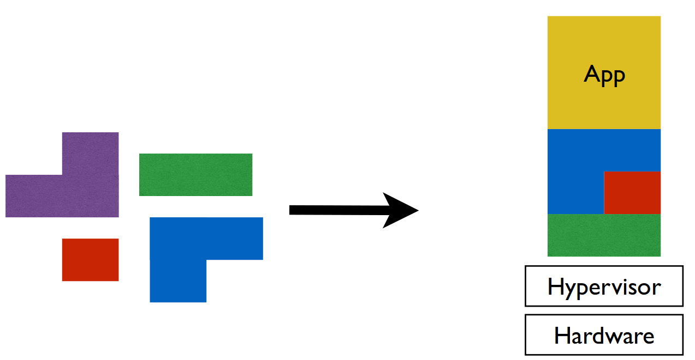
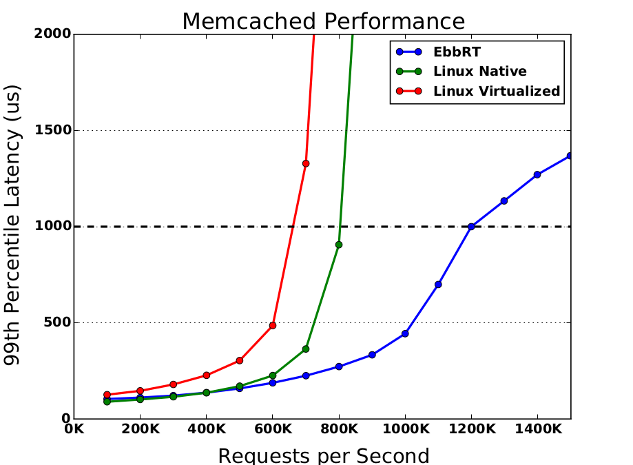
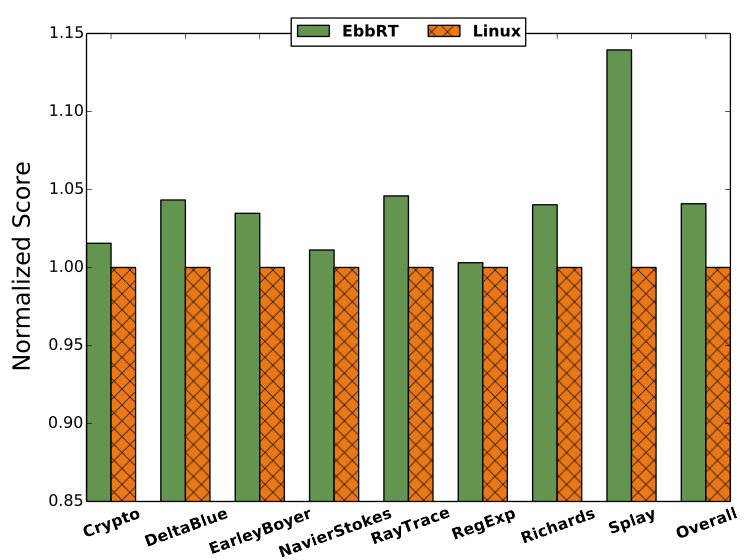

The Elastic Building Block Runtime (EbbRT)
=====

** This is a research project out of the Boston University Computer
   Science Department **

Computers used to be large, expensive and centrally owned. Operating
systems were designed to multiplex hardware across multiple
applications and users. Presently, Cloud Computing allows users to
rent entire virtual machines to run their own OS and applications. In
this context, the hypervisor multiplexes hardware across multiple
applications and users. We can build more efficient software by
constructing custom, application-specific operating systems rather
than deploying general purpose operating systems within virtual
machines.

## Results

Using EbbRT, we are able to achieve ~2x better throughput at SLA for
memcached.

A port of the node.js javascript environment obtained ~4% improvement
on pure compute workloads (no I/O).

## Design

EbbRT is designed first and foremost for performance and
maintainability. A high performance system that cannot be maintained
will soon fall behind. This is one of the primary pitfalls of
customized systems. EbbRT adopts several techniques in order to
achieve this:

* EbbRT is comprised of a set of components that developers can
extend, replace or discard in order to construct and deploy a
particular application. This enables a much greater degree of
customization than existing general purpose systems while promoting
the reuse of non-performance-critical components

* EbbRT components run in a light-weight event-driven environment. This
reduces the runtime complexity yet provides enough flexibility for a
wide range of applications.

* EbbRT library operating systems can run within virtual machines on
unmodified hypervisors. This allows us to deploy EbbRT applications on
commodity clouds.

* EbbRT library operating systems run alongside general purpose
operating systems. This allows functionality to be offloaded for
compatibility, reducing the maintenance burden by avoiding the
construction of new software.

* EbbRT uses many modern and high-level programming techniques not
typically found in operating systems software. This was chosen
deliberately to reduce the complexity of the software.

## Detail

EbbRT is comprised of a set of an x86_64 library OS and toolchain as
well as a Linux userspace library. Both runtimes are written
predominately in C++11. The native library OS is deployed along with a
modified GNU toolchain (gcc, binutils, libstdc++) and newlib (libc)
that provide an x86_64-ebbrt target. Application code targeting the
native library OS is compiled with this toolchain and the resulting
binary is a bootable ELF linked with the library OS. We provide C and
C++ standard library implemen- tations which make it straightforward
to use many third party software libraries.

## Further Reading

[Our latest technical report (PDF)](doc/tech-report.pdf)

## Contact

Please email us at sesa-developers@googlegroups.com
